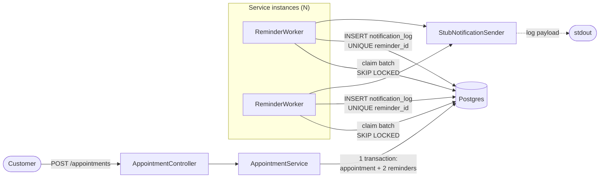
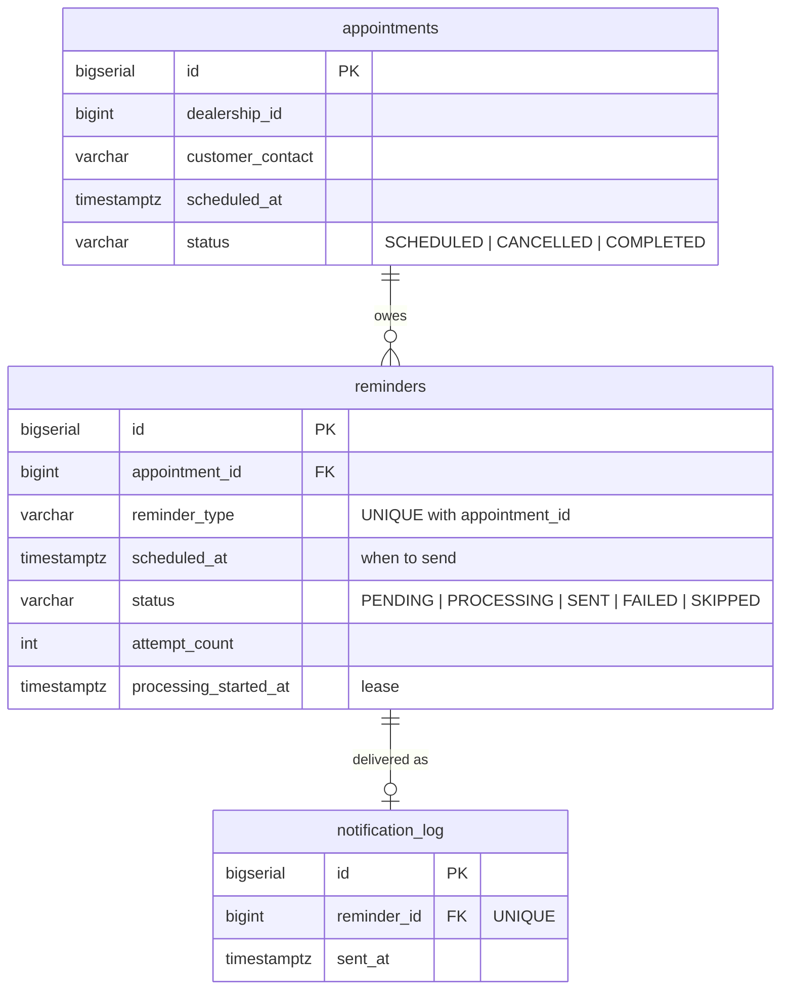
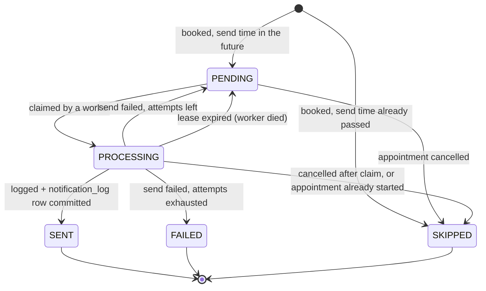
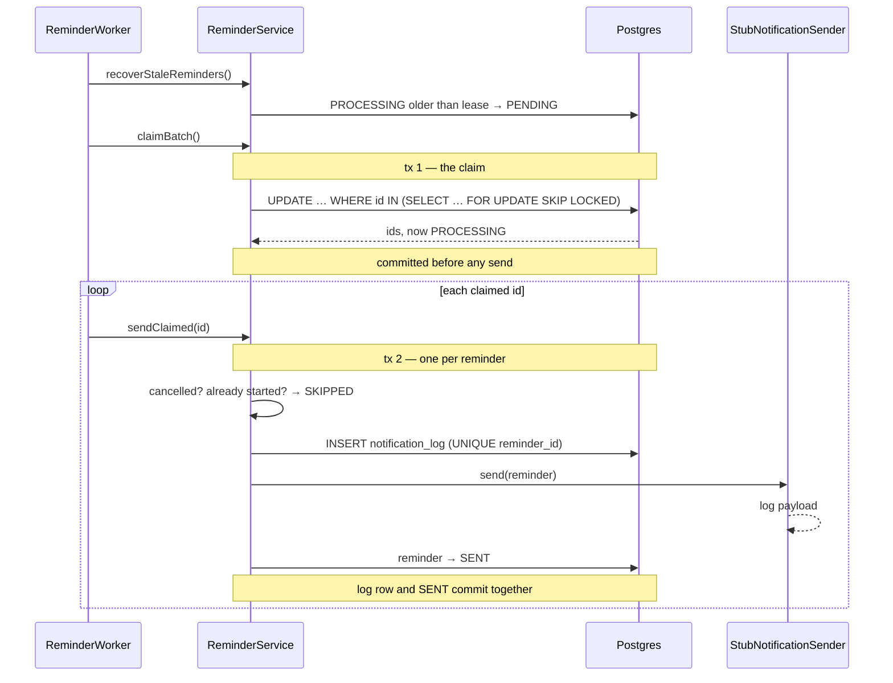

# Architecture

[← README](../README.md)

Two independent paths share one table. Booking writes reminder rows; the worker
drains them. Neither knows about the other, which is what lets them scale apart.

## Tables

Two constraints carry the correctness of the whole service:

- `UNIQUE (appointment_id, reminder_type)` — an appointment can never accumulate
  a second 24h or 2h reminder, however many times booking is retried.
- `UNIQUE (reminder_id)` on `notification_log` — a reminder can never be
  delivered twice, however many workers race.

## The reminder's life

`PROCESSING` is a lease, not a lock. It survives the process that took it, which
is the point: a lock held by a dead JVM is invisible, a `PROCESSING` row with an
old `processing_started_at` is not.

## One poll

The `notification_log` insert sits in `ReminderService`, not in the sender, so the
"never twice" guarantee doesn't depend on which `NotificationSender` is wired in.

The claim commits **before** any sending. Two reasons, both load-bearing:

1. Holding the claim open across the send would mean the sender's insert into
   `notification_log` blocks on the foreign-key lock the claim still holds — the
   worker would wait on itself until the lease expired.
2. A worker that dies after the claim leaves durable `PROCESSING` rows. The
   reaper can see them. An uncommitted claim would simply roll back — which is
   also safe, but slower to notice than it looks under a partial network failure.

The loop lives in the worker rather than the service because each step must be
its own transaction, and a service calling its own methods bypasses the Spring
proxy — `@Transactional` would silently do nothing.
